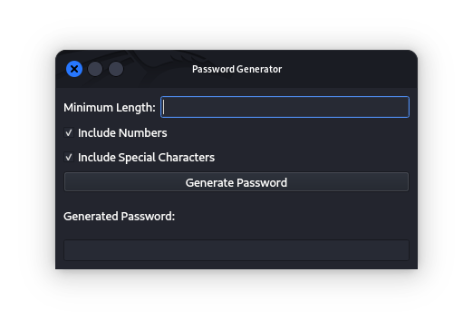
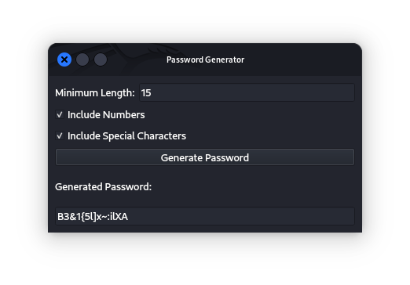
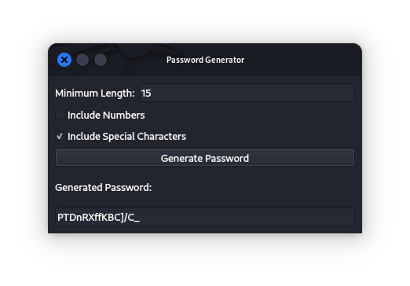
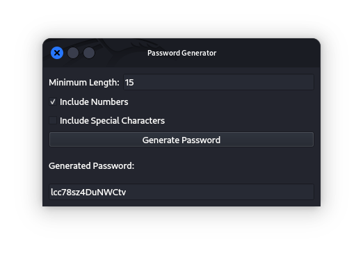
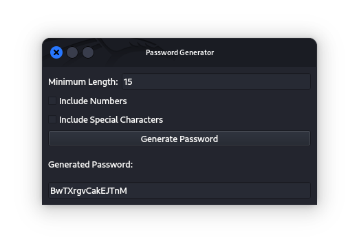

# Password Generator App

This Python Password Generator app allows users to generate random passwords based on specified criteria such as minimum length, inclusion of numbers, and special characters.

## Features

- **Password Criteria:**
  - **Minimum Length:** Specify the minimum length of the password.
  - **Include Numbers:** Option to include numbers in the password.
  - **Include Special Characters:** Option to include special characters in the password.

- **User-Friendly GUI:** Built with PyQt5 for a smooth and intuitive user interface.

- **Validation:** Ensures that the input values are valid and meet the specified criteria.

### Prerequisites

- Python 3.x
- PyQt5 library (`pip install PyQt5`)

## Installation

1. Clone the repository:

    ```sh
    git clone https://github.com/yourusername/password_generator.git
    cd password_generator
    ```

2. Install dependencies:

    ```sh
    pip install PyQt5
    ```

## Usage

To run the application, use the following command from the project directory:

```sh
python main.py
 ```

## How to Use

1. **Minimum Length:**
    - Enter the desired minimum length for the password.

2. **Include Numbers:**
    - Check the box to include numbers in the password.

3. **Include Special Characters:**
    - Check the box to include special characters in the password.

4. **Generate Password:**
    - Click the 'Generate Password' button to generate a password based on the specified criteria.

## Contributing

Contributions are welcome! Please read [CONTRIBUTING.md](CONTRIBUTING.md) for details on our code of conduct and the process for submitting pull requests.

## License

This project is licensed under the MIT License - see the [LICENSE](LICENSE) file for details.

## Screenshots

<table>
    <tr>
        <td>
            
            <p>Password Generator APP</p>
        </td>
        <td>
            
            <p>Password Generated with all parameters</p>
        </td>
        <td>
            
            <p>Password Generated without numbers</p>
        </td>
        </tr>
        <tr>
         <td>
            
            <p>Password Generated without special characters</p>
        </td>
        <td>
            
            <p>Password Generated without numbers & special characters</p>
        </td>
    </tr>
</table>
